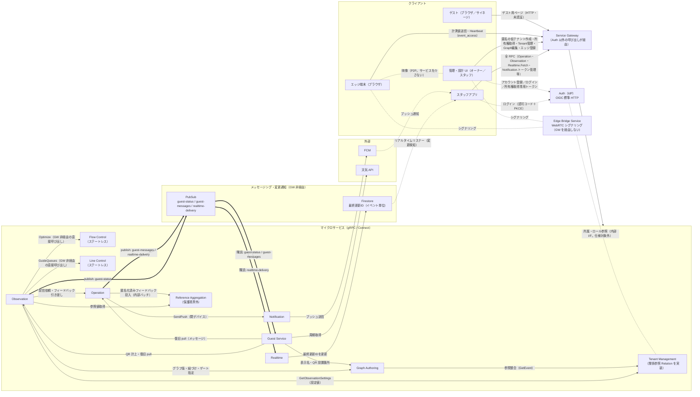
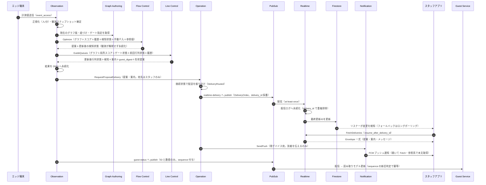
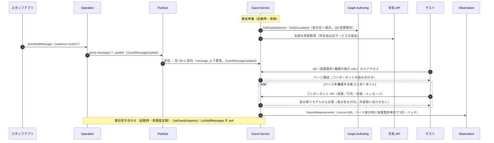
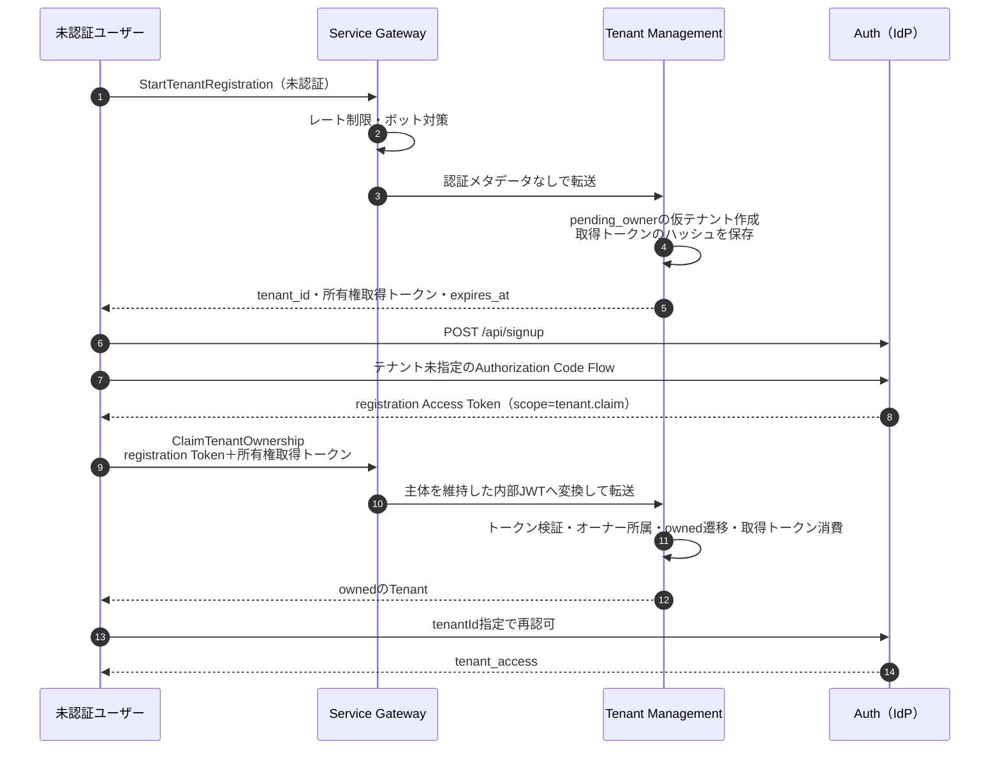

# サービス間の関係と主要なやり取り（図）

作成日: 2026-07-02
位置づけ: サービス（デプロイ単位）視点の図。ドメイン（コンテキスト）視点は domain/context_map.md が正本
内容の根拠: spec-base/README.md（通信規約・索引）と service/ 各仕様。図と本文が食い違う場合は各仕様が正

前提（凡例に共通）

- Auth、Edge Bridge Service、および Observation → Flow／Line（直接呼び出し）以外の同期 RPC はすべて Service Gateway を経由する。図では見やすさのためサービス間の GW を省略
- Edge Bridge Service は WebRTC のシグナリングのみを担い、Service Gateway の後ろに置かない。映像はページ間で直接やりとりする
- PubSub は情報更新 push の3トピックのみ。at-least-once・イベント単位の順序キー・受信側冪等
- 実線＝同期 RPC（gRPC／Connect）または HTTP、太線（==>）＝PubSub、点線＝リスナー・参照系・外部プッシュ
- BFF は図では省略（管理・設計 UI の Auth・GW への接続は BFF 経由）
  スタッフアプリはログインのみ直接 Auth と接続し、Token Exchange は BFF が代行（アプリ→BFF→Auth。構成B）。API 呼び出しはアプリ→GW のまま

## 1. サービス間の関係全体図

補足

- IdP 発行トークンは Service Gateway が検証し、内部 JWT へ変換して各サービスへ転送する。JWKS と introspection の endpoint は OIDC Discovery と Authorization Server Metadata から解決する（service_gateway.md）
  各サービスは Service Gateway の JWKS で内部 JWT をローカル検証する（図では省略）
- introspection は管理系書き込み6 RPCの active／revoked 確認に限定し、同じ6 RPCの現在権限は Tenant Management が同一 DB で確認する
- Flow／Line の呼び出し元は観測のみで、この呼び出しは Service Gateway を経由しない（各仕様参照）。Realtime・Notification は Operation の支援機構（独立コンテキストではない）
- Firestore の読み取り（Realtime の変更検知、WebRTC シグナリング）は Firebase Auth カスタムトークンによるアクセス制御を伴う（realtime.md、edge_bridge.md）
- 関係参照（RelationAdminService）はTenant Managementが実装する。ClaimTenantOwnershipのオーナー所属作成はサービス内部で完結し、サービス間RPCを経ない
- ゲート開閉（OperateGate）・観測点設定変更（UpdateObservationPointConfig）はスタッフアプリ→Observation の直接呼び出し。Operation→Observation の同期 RPC はない
- Reference Aggregation はどのテナント保護境界にも属さず、入出力に テナント識別子を持たない

## 2. やり取りの図（シーケンス）

### 2.1 主系統: 計測 → 最適化 → スタッフ配信・ゲスト状況更新

計測値の受信から、スタッフへの提案配信（開＝Realtime／閉＝Notification）とゲスト向け状況の更新までの一連の流れ
グラフ・紐づけ・ゲート指定の取得は毎回ではなく版の更新に応じて行う（図では1回で代表）

### 2.2 ゲスト向けメッセージとゲストアクセス

スタッフの手動配信がゲストに届くまでと、ゲストのアクセス時応答（自 DB のみで完結）

### 2.3 匿名の仮テナント作成と所有権取得

